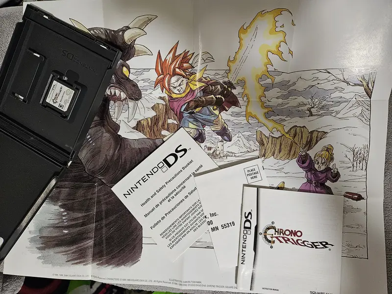
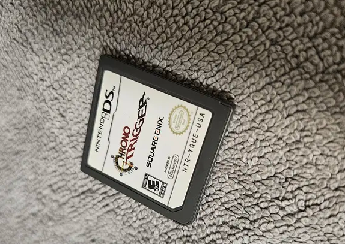
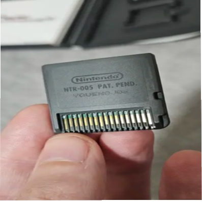

## Nostalgia time:
Remember the first time you heard that clock tick—tick—tick and your stomach did a little flip? For some of us it was a chunky SNES cart; for others (hi, that’s us today) it was the slick snap of a Nintendo DS cartridge sliding into place. Either way, Chrono Trigger isn’t just a game, it’s a time machine that still smells faintly of fresh manual ink and late-night hot chocolate.

## Wings of Time:
Chrono Trigger (1995, Super Nintendo) is the gold standard for time-travel RPGs,
dreamed up by a “Dream Team” of legends: writer/designer Yuji Horii (Dragon Quest), artist Akira Toriyama (Dragon Ball), and composers Yasunori Mitsuda with Nobuo Uematsu (Final Fantasy). 
It pioneered New Game+, branching endings, and that buttery Active Time Battle system with team attacks that made you feel clever, not confused. The Nintendo DS version (2008) isn’t just a port it’s a celebration. You get the animated cutscenes from the PS1 release, a more faithful translation, a tidy dual-screen UI, and bonus content like the Lost Sanctum, Dimensional Vortex, and the monster-raising Arena of Ages. 
If you grew up with a DS or you’re returning to the hobby, the CT DS cart is one of the friendliest ways to experience the magic on real hardware (and yes, it runs on a 3DS too).

## Collecting:
So why is the DS release such a sweet spot for collectors? Three big reasons:

1) **Playability + Portability:** The DS version plays beautifully, travels well, and adds quality-of-life bits like touch commands and an in-game bestiary. It’s the “grab-and-go” version you’ll actually finish.  
2) **Package Appeal:** A Complete-in-Box (often shortened to **CIB**) DS copy includes the white plastic case with the “Nintendo DS” spine, the manual, and any inserts (like the health & safety booklet and Club Nintendo card and a poster of the box art in some regions). EU copies carry a PEGI rating on the front; North American copies show the ESRB.  
3) **Value Position:** While the original SNES cart and especially a SNES CIB can get pricey, the DS release tends to be more accessible—still collectible, but less terrifying to the wallet. It’s climbed over the years (popular games do!), but it remains a smart “play it and love it” pickup that also looks great on the shelf.

If you like variants, keep an eye out for regional packaging differences (PEGI vs ESRB, multilingual manuals, small barcode stickers from specific retailers). Sealed copies exist, but those are best for advanced collectors who are comfortable authenticating shrink-wrap patterns and factory seams. For most of us, a clean CIB is the perfect middle ground: display-worthy and totally playable.

## Tips:
New to collecting? Here’s your Chrono Trigger DS quick-start:

- **Know the lingo:**  
  - **CIB** = game + original case + original manual/inserts.  
  - **Loose** = cartridge only.  
  - **Sealed** = never opened; factory wrap intact.  
  - **Repro** = reproduction; not an official Nintendo release. Good for filler, not for long-term value.

- **Where to buy:** Check local retro game shops, car-boot sales (bring cash and patience!), trusted online marketplaces, and collector groups. UK readers: shops will often grade condition clearly, and places like CeX list stock online—handy for checking availability before you trek out.

- **Authenticity checks (DS edition):**  
  - Cartridge shell should feel sturdy with a proper tri-wing screw on the back and crisp “NTR-005 PAT. PEND.” text.  
  - Label printing should be sharp—no fuzzy edges or off-colours—and sit perfectly centered with clean cuts around the curve.  
  - Light test: hold the cart to a bright light and look for a proper PCB; legit boards have neat traces and “Nintendo” markings.  
  - Case: look for the embossed “Nintendo DS” logo on the plastic and high-quality, correctly aligned cover art under the clear sleeve. Manuals should be well-cut, not washed-out photocopies.

   
  

- **Condition cues:** Sun-faded spines, crushed corners, or manual staining will lower value. DS carts usually save to flash memory, so you’re not worrying about a dead save battery like on some older cartridges.

- **Price sanity:** Compare recent sold listings (not just “asking” prices). If a deal looks unreal, slow down—repros of popular DS titles are common.

- **Play it!** Collecting is more fun when you actually time-hop with Crono and friends. A gentle starter goal is to finish once, then try New Game+ for a couple alternate endings.

## Fun facts:
Chrono Trigger’s soundtrack almost didn’t happen the way we know it: Yasunori Mitsuda reportedly worked so hard he fell ill, and Final Fantasy’s Nobuo Uematsu stepped in to help finish the score. The DS version lets you appreciate those tracks with minimal loading and tidy menus—perfect for slipping on headphones and getting lost in “Corridors of Time.” Also neat: the DS release’s revised script restores a handful of names and nuances closer to the Japanese original, which longtime fans love to debate over tea.

## Closing thoughts:
Every time I click that DS cart into place and the title theme swells, I’m right back in the school holidays—window open, rain tapping the sill, trying to figure out if I should grind a bit or risk tackling Magus under-leveled. If your copy is sitting on a shelf, give it a spin tonight. Visit 1000 A.D., make friends with a melancholic robot, and let a talking frog remind you that bravery wears many faces. That’s the joy of collecting: not just owning history, but stepping into it whenever you need a little wonder.

If you’re new here, follow the blog for weekly, beginner-friendly posts that mix nostalgia with practical collecting tips. We’re starting with cornerstone RPGs (and yes, plenty of Pokémon goodness), then branching into Final Fantasy, Zelda, and more. See you soon, and don’t forget to save before you time-travel!
