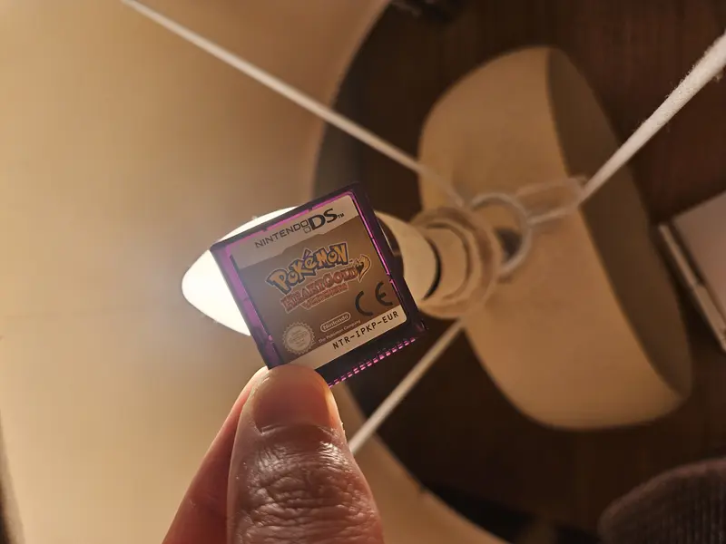

# Collecting Pokémon HeartGold & SoulSilver: A Johto Journey Worth Taking

## A Nostalgia Hook
Do you remember the first time you slid that Pokéwalker onto your belt loop and strutted around like you were training for the Pokémon League? Maybe you clipped it to your backpack in school, proudly shaking it during class to rack up steps (and hoping your teacher wouldn’t notice). For many of us, *Pokémon HeartGold* and *SoulSilver* weren’t just DS cartridges—they were our golden tickets back to Johto, complete with a Tamagotchi-style gadget that made us feel like real Trainers again.  

## Back to Johto
Released in 2009 in Japan and 2010 in North America and Europe, *Pokémon HeartGold* and *SoulSilver* were enhanced remakes of the beloved *Gold* and *Silver* from the Game Boy Color days. These DS titles pulled us back into the world of Johto with a fresh coat of 3D polish, updated battle sprites, and a nostalgic soundtrack that still gives me goosebumps. But what really set them apart was that magical little Pokéwalker pedometer, which let you transfer a Pokémon from your game and take it on a real-world stroll. Every step counted—literally—and it turned a trip to the local shop into a mini-adventure.  

## Why Collect HeartGold & SoulSilver?
Here’s why these games are on so many collectors’ radars today:  

- **Pokéwalker Completeness**: Finding a copy with the original Pokéwalker (and that tiny plastic clip) skyrockets the value. Loose cartridges are fun to play, but a *Complete in Box* (often abbreviated “CIB”) set with Pokéwalker, manuals, and inserts is where collectors get excited.  
- **Condition is King**: Because the Pokéwalker was meant to be used, many secondhand units are scratched, missing battery covers, or nonfunctional. Pristine ones—or better yet, sealed copies—are incredibly desirable.  
- **Value Trend**: A few years ago, you could scoop up a loose copy for around £20. Today? Expect £80–100 for a cartridge alone, and £120+ for a boxed copy, £220+ for CIB (including pokewalker) sets in good condition. Sealed copies can push into the £700–800 range, depending on region.  
- **Regional Variants**: The Japanese releases had slightly different packaging and inserts, which some collectors chase specifically to build a “world set”.  

## Beginner Tips for Collectors
If you’re itching to add *HeartGold* or *SoulSilver* to your shelf, here’s some beginner-friendly advice:  

- **Start Small**: Don’t stress if you can’t afford the full CIB right away. Grab a loose cart first—you’ll still get the joy of revisiting Johto.

- **Check Authenticity**: Flip the DS cart over and look for the tiny imprinted code. Genuine DS games have a slightly raised, etched number above the connectors. Repro (reproduction) carts often miss this detail or feel lighter in hand. The other thing you can check is if you can see through the cartridge when held up to light.   

- **Where to Hunt**: eBay and PriceCharting are obvious choices, but don’t sleep on local retro shops, car boot sales, or even Facebook Marketplace. Sometimes you’ll stumble across a parent selling their kid’s old DS stash for cheap.  

- **Pokéwalker Caution**: If you’re buying a Pokéwalker, confirm the battery compartment isn’t corroded. And make sure it comes with the back covers it’s surprisingly hard to find those separately.  

- **Play vs Display**: Decide early if you want a copy to play or one to keep pristine. It’s totally fine to have a “player cart” and a nicer boxed version for display later.  

## Fun Fact
Here’s a neat tidbit: the Pokéwalker wasn’t just a gimmick—it actually had exclusive Pokémon and items you could only obtain by walking! This included rare finds like Surfing Pikachu, making the accessory a true gameplay enhancer, not just a pedometer. In a way, it was Pokémon GO before Pokémon GO—seven years early.  

## Closing Thoughts
For many collectors myself included, *HeartGold* and *SoulSilver* hit that sweet spot: they’re modern enough to feel polished, but old enough to tug at our childhood memories of Johto. Every time I see that gleaming Ho-Oh or Lugia box art on a shelf, I can almost hear the chiptune cries of my first Cyndaquil and remember trading with friends by holding our DS systems back-to-back. Whether you had the patience to grind steps on your Pokéwalker or just loved the thrill of re-challenging the Kanto region after Johto, these games aren’t just cartridges—they’re time machines.  

