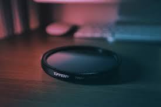

Retro collecting is fun — but the market is full of counterfeit carts.  
Here are the top things to watch for when buying GBA games:

## Quick tells
- **Label stock**: real carts use glossy, high-quality stock. Counterfeits look flat.
- **Print dots**: zoom in and you’ll see inkjet-style dots on fakes.
- **Screws**: official carts use security bits, not plain Phillips.
- **PCB window**: some fakes show the wrong board color or missing chips.

